# Mini Strike

A small tactical shooter in the style of Counter-Strike, written in C++17. You log in to a server, pick a room
and play: duels, team rounds or deathmatch, with CS2-style movement, spray patterns, grenades and skins.

- **Online:** a dedicated server with many rooms at once. Rooms can have a password, a map, a mode, weather and
  gameplay modifiers.
- **One Mini Strike account:** log in once, then every server lets you in by itself (like Steam in CS2). Coins,
  skins, stats and your settings (sensitivity, crosshair, ...) are kept with it. LAN games work without one.
- **LAN:** play with people on the same network without any server; one player hosts from the game.
- **Gameplay:** 8 weapons including a knife, 4 grenades (HE, flashbang, smoke, molotov), 6 maps, 7 game modes
  (among them bomb defusal and gun game), 17 modifiers,
  10 character skins and 18 weapon skins you win from cases.

The game runs on Windows (Direct3D 11). The server runs on Linux or Windows. The only external code is
[cgltf](https://github.com/jkuhlmann/cgltf) (MIT) to read the weapon models and
[Monocypher](https://monocypher.org) (CC0 / BSD-2) to encrypt the network traffic. The weapons are textured 3D models
(glTF) with their skins, the players are built from boxes, and the map textures are generated when the game
starts. The sounds are real recordings of guns, footsteps and weather from freesound.org and soundbible.com
([credits](#credits)), built into the exe.

| | |
|---|---|
| 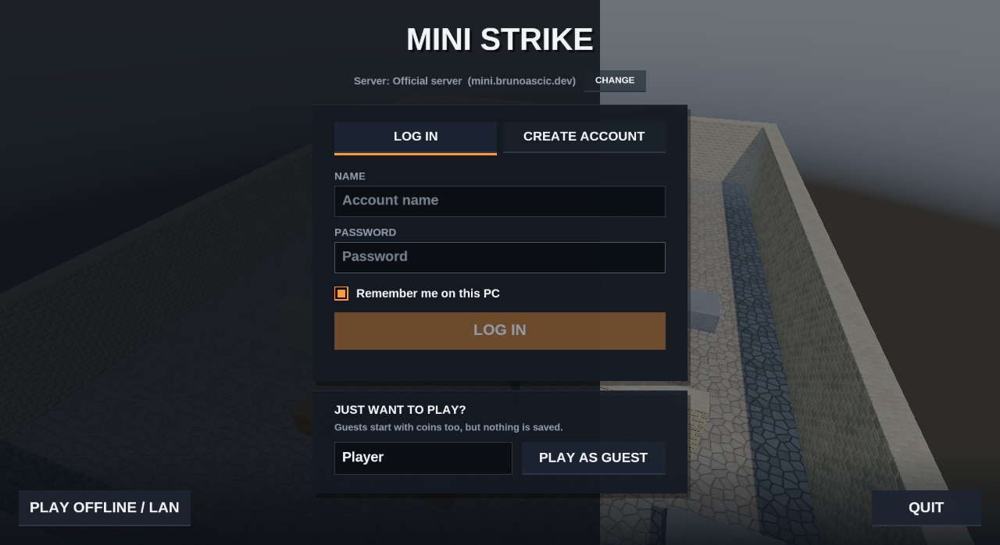 | 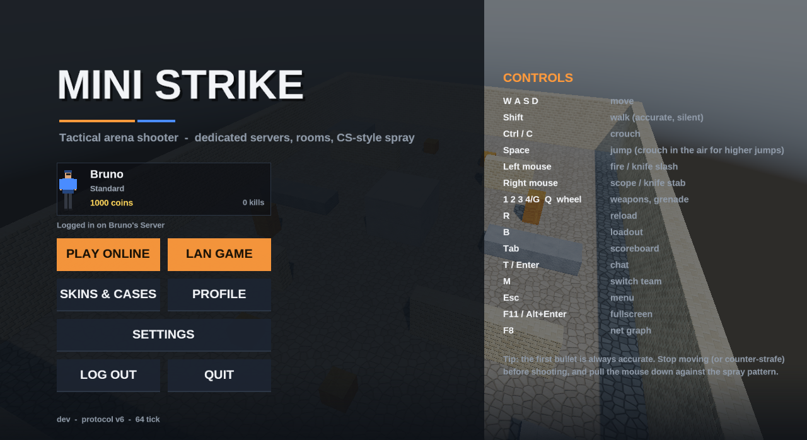 |
| 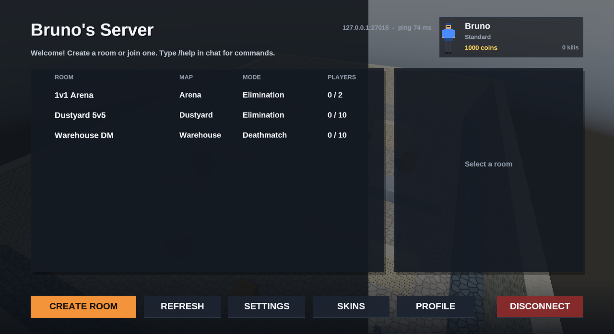 | 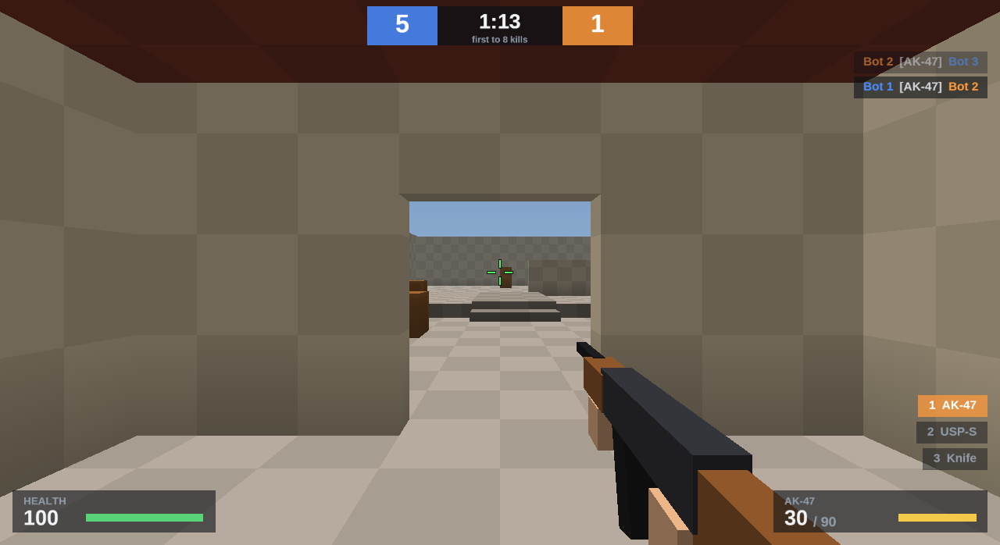 |

## Contents

- [Playing](#playing): [get the game](#get-the-game) · [log in](#log-in) · [main menu](#main-menu) ·
  [rooms](#rooms) · [LAN games](#lan-games) · [controls](#controls) · [console](#console) ·
  [video settings](#video-settings) ·
  [virus warning](#windows-says-the-game-is-a-virus)
- [Gameplay](#gameplay): [movement](#movement-and-crouching) · [accuracy](#accuracy-and-spray) ·
  [weapons and grenades](#weapons-and-grenades) · [maps](#maps) · [modes](#game-modes) · [modifiers](#modifiers) ·
  [skins and coins](#skins-and-coins)
- [Accounts](#accounts)
- [Running a server](#running-a-server): [install](#install-on-linux) · [configure](#configure) ·
  [network](#open-the-port) · [**update**](#update-to-a-new-version) · [manage](#manage-the-server) ·
  [**admins and moderators**](#admins-and-moderators) ·
  [Docker, Windows and by hand](#other-ways-to-run-it)
- [Limitations](#limitations)

---

# Playing

## Get the game

1. Download `MiniStrike-windows-x64.zip` from the [Releases](https://github.com/brunoascic/ministrike-release/releases) page (the newest one is at the top).
2. Unzip it anywhere and start `MiniStrike.exe`. You need 64-bit Windows 10 or 11.

The game keeps its settings next to the exe (`ministrike.cfg`, `ministrike_logins.cfg`), so you can move the
folder around. To update, unzip the new version over the old one; your settings stay.

**Windows Defender or SmartScreen may block the exe.** The programs are not code-signed and are built fresh on
every release, so antivirus heuristics sometimes flag them (for example as `Trojan:Win32/Wacatac.B!ml`), even
though they are built automatically from the same source for every release. To be sure you have the genuine file, compare
the SHA256 of the zip with the value shown next to it on the release page:

```
Get-FileHash .\MiniStrike-windows-x64.zip -Algorithm SHA256
```

If the hashes match and you trust the source, extract the zip into a folder of its own and add that folder as an
exclusion (Windows Security → Virus & threat protection → Manage settings → Exclusions).

## Intro

When the game starts, it first plays the intro video, then the animated Mini Strike logo, and then the
menu comes up as usual (logging in continues in the background). Any key or mouse click skips a part.
Switch it off in the settings (*Intro at start*). It doesn't play when the game is started with command
line options.

The video is embedded in `MiniStrike.exe`, so no extra file has to be shipped. The intro has no sound.

## Log in

The login screen is the first thing you see: your **Mini Strike account**, kept by the official server
`game.ministrike.ch`. You log in once; after that every server with Mini Strike accounts lets you in by itself (the
game fetches a ticket from the official server for it), you never type your password on another server.

- **Create account:** pick a name (3-15 letters, digits, `_`, `-`, `.`) and a password (6 characters or more).
- **Log in** with an existing account. With **Remember me** the game logs you in by itself next time (it keeps a
  login token, not the password).
- After the login comes the **server list**: the official server first, then public community servers, servers in
  your network and the ones you used before. Double-click one and its rooms come up, no second login.
  **Servers** (in the rooms) goes back to the list, **Back** in the list to the main menu.
- Joining a server without being logged in (e.g. from a link) shows the login first and then joins that server.
- **Play offline / LAN** skips the login. LAN games and the settings work without an account; online, everybody
  plays with their account (no guests).
- **Profile:** **Change password** and **Log out other PCs** end the login on every other PC (they have to log in
  again); **Log out** ends it on this one.
- Your settings (mouse, crosshair, HUD, loadout, volumes) are saved with the account and follow you to every PC;
  the video settings stay on each PC. Whatever was changed last wins (also changes made offline).

**Everything between the game and the server is encrypted**, and the game makes sure it talks to the real server:
it remembers each server's key the first time (in `ministrike_known_servers.txt` next to the game; not for LAN
games). If a server
later shows up with another key, the game refuses to connect and says so. That happens when the owner set the
server up again from scratch, or when someone is posing as it; if you know it's the first, delete that server's
line in the file and connect again.

## Main menu

| Button | What it does |
|---|---|
| **Play online** | the server list (official and community servers), then the rooms of the one you pick |
| **LAN game** | host or join a game on your local network (logs you out of the server while you play) |
| **Skins & cases** | your skins; open cases with the coins you earn |
| **Profile** | your stats: kills, deaths, K/D, headshots, wins, time played... |
| **Settings** | tabs for game (mouse sensitivity on the CS scale, FOV, HUD), video, audio (volume per category) and the crosshair editor |
| **Log out** | back to the login screen (and forget "remember me") |

Clicking your name in the top left also opens the profile.

## Rooms

Pick a server in the server list and its rooms come up. Double-click one to join; rooms with a padlock ask for the
password. **Servers** goes back to the server list. **Create room** lets you pick:

- name and optional password
- map, mode (elimination, duel, competitive, deathmatch, team deathmatch), max players (2-10), weather
- score limit, round or match time, start health, freeze time and [modifiers](#modifiers)
- **bots** (computer players) and how good they are: Easy, Normal or Hard

The player who creates a room owns it and can use chat commands: `/map <name>`, `/restart`, `/kick <name>`
(the exact name, or a beginning that fits only one player), `/maps`. Everyone can use `/team` and `/help`. Rooms
close when the last person leaves (bots don't keep a room open; permanent rooms from the server config stay).

**Bots** work in online rooms and in LAN games alike. The room owner changes them during the game in the Esc
menu (**-** / **+** and the difficulty) or with chat commands:

| Command | What it does |
|---|---|
| `/bot add [n]` | add one bot (or n) |
| `/bot remove [n\|all]` | remove one bot (or n, or all); `/kick BOT Anna` removes a certain one |
| `/bot easy`, `/bot normal`, `/bot hard` | how well they aim, react and control the recoil |
| `/bot` | how many there are |

- Bots run on the server as part of the room: they move, aim, spray (pulling down against the recoil), scope
  with the AWP, reload and walk around the map looking for enemies, with the same rules as people.
- A room full of bots still lets people in: a bot leaves for everyone who joins. The lobby shows them as
  "+2 bots" next to the players.
- Kills of bots give no coins and don't count in your account stats, and a match won with only bots against
  you earns no win reward, so bots can't be used to farm coins.

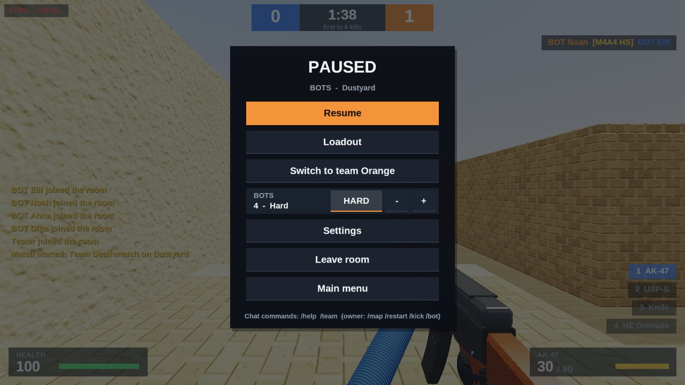

## LAN games

For playing with people next to you (home, office, LAN party). No server and no account are needed.

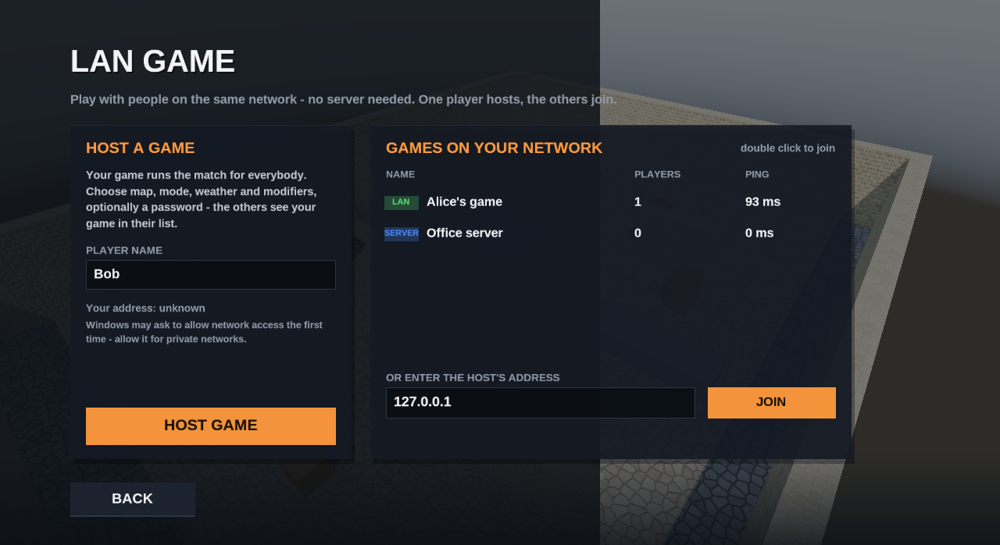

1. Everyone clicks **LAN game** in the main menu.
2. One player clicks **Host game**, sets up the room and clicks **Start game**.
3. The others see the game under **Games on your network** and double-click it. If it doesn't show up (other
   subnet, VPN), type the host's address, which the host sees on their LAN screen.

The first time you host, Windows asks whether Mini Strike may use the network: allow it for **private
networks**. Everybody plays as a guest, nothing is saved. When the host leaves, the game ends for everyone.

## Controls

| Key | Action |
|---|---|
| W A S D | move |
| Shift | walk (accurate and silent) |
| Ctrl or C | crouch |
| Space | jump (crouch in the air to jump higher) |
| Left mouse | fire · knife slash · throw grenade |
| Right mouse | AWP scope (2 levels) · knife stab · lob grenade |
| 1 / 2 / 3 / 4 or G | primary / secondary / knife / grenade |
| Q, mouse wheel | last weapon, cycle weapons |
| R | reload |
| F | inspect the weapon (turns it to show the skin; firing, reloading or switching stops it) |
| E (hold) | bomb defusal: plant the bomb on a site, defuse it |
| B | loadout (pick weapons and grenade) |
| Tab | scoreboard |
| T or Enter | chat (`/help` for commands) |
| M | switch team |
| Esc | menu (resume, loadout, team, settings, leave room, server list) |
| F11 or Alt+Enter | window ↔ fullscreen (the mode chosen under Settings → Video) |
| F8 | net graph (F5/F6 simulate lag and packet loss, F7 shows hitboxes) |
| F1, ~ or ^ | [console](#console) |

## Console

Press **F1** (or the key left of 1: `~` on US keyboards, `^` on German ones) to open the console, in the menus
and in the game. **Tab** completes commands, **↑/↓** go through the history, the mouse wheel and PgUp/PgDn
scroll.

| Command | What it does |
|---|---|
| `help [command]` | the game commands, plus the server commands you are allowed to use |
| `status`, `whoami`, `version` | connection, account, role, room, ping, fps |
| `connect <address>`, `retry`, `disconnect`, `logout` | server connection |
| `say <text>`, `team` | chat, switch team |
| `equip <skin>` | wear a skin you own: `equip Dragon Lore`, `equip AK-47 \| Red Stripe`, `equip awp default` |
| `sensitivity`, `fov`, `volume` (and `volume_weapons`, `volume_effects`, `volume_footsteps`, `volume_weather`, `volume_interface`), `vsync`, `fullscreen`, `net_graph`, `show_fps`, `show_ping`, `killcam`, `hitboxes` | settings (no value: show the current one) |
| `players`, `rooms`, `top` | from the server: who is online, the rooms, the best players |
| `clear`, `quit` | clear the console, close the game |

Everything else is sent to the server, which runs it if your role allows it: see
[admins and moderators](#admins-and-moderators).

## Video settings

**Settings → Video** chooses the display:

- **Display mode:** *Window*, *Fullscreen window* (borderless, in the desktop's resolution, quick Alt+Tab) or
  *Fullscreen* (the monitor switches to the chosen **resolution** and **refresh rate**: the lowest latency). In
  Fullscreen, Alt+Tab gives the monitor back and the game takes it again when you return.
- **APPLY** switches; keep the new display within 15 seconds or it goes back by itself (a mode the monitor can't
  show can't lock you out).
- **VSync**, **Max FPS** (without VSync; *Unlimited* possible) and **Menu and HUD size** (automatic: bigger from
  1080p up, so menus keep their size in 1440p and 4K).

The game draws in the screen's real pixels, also with Windows display scaling (it is DPI aware), and on Windows 10
and 11 it shows its frames directly in fullscreen (flip model, without VSync also with tearing instead of waiting).

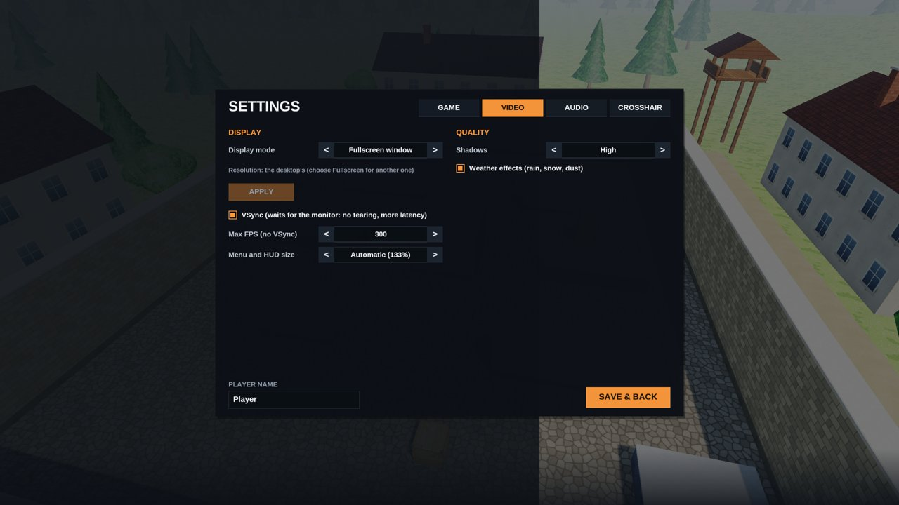

## Windows says the game is a virus

The game isn't malware, but new, unsigned games are often flagged ("Windows protected your PC" or a Defender
detection such as `Trojan:Win32/Wacatac` - "!ml" means a machine-learning guess). What the game does about it:

- It reads the keyboard only through its own window's messages. Older versions polled every key of the whole
  system each frame, which is exactly what keyloggers do and what antivirus heuristics look for.
- The exe has an icon, version information (product, description, version) and a manifest, like normal
  programs. Anonymous executables without them look suspicious.
- Release builds can be **code signed**: this is what really makes the warnings go away. Add a code signing
  certificate as the repository secrets `WINDOWS_CERT_PFX_BASE64` (the .pfx file, base64) and
  `WINDOWS_CERT_PASSWORD`, and the release workflow signs `MiniStrike.exe` and the server automatically.
  Certificates cost money (for example Azure Trusted Signing, about 10 $ a month, or an OV certificate from a
  certificate authority, about 100-300 $ a year).

What you can do right away:

- **SmartScreen** ("Windows protected your PC"): click **More info** → **Run anyway**. It stops asking once a
  file has been run by enough people or is signed.
- **Defender quarantined it:** Windows Security → Virus & threat protection → Protection history → **Allow** /
  **Restore**. You can also add an exclusion for the game folder.
- **Report the false positive** to Microsoft at https://www.microsoft.com/wdsi/filesubmission (choose
  "Software developer", upload `MiniStrike.exe`). Detections are usually removed within a few days, and that
  version is then fine for everyone.

---

# Gameplay

## Movement and crouching

Movement works like in CS: friction and acceleration on the ground, air strafing, 1.45 m jumps, and you walk up
stairs. **Crouching** takes about 0.14 s. It lowers you and your hitboxes, slows you to 34 % and makes you more
accurate. You can't stand up under a low ceiling. Crouching in the air pulls your legs up (**crouch jump**), so
you reach ledges that a normal jump doesn't.

## Accuracy and spray

- **First shot:** standing still or crouching, the first bullet goes exactly where you aim.
- **Moving:** above 34 % of the weapon's top speed you get very inaccurate. Walking slowly or right after a
  **counter-strafe** you are accurate again. Jumping is very inaccurate.
- **Spray patterns:** every automatic weapon has a fixed pattern you can learn. The AK climbs for about 9
  bullets and then sways left, right and left; the M4 climbs less and drifts right. The camera follows 45 % of
  the recoil like in CS, so pull the mouse down and against the sway. The pattern resets after a short pause.
- **Spamming** adds random spread that recovers over time.
- **Damage:** head x4, stomach x1.25, chest x1, legs x0.75, less at long range.

## Weapons and grenades

| Slot | Weapon | Damage | RPM | Mag | Notes |
|---|---|---|---|---|---|
| 1 | AK-47 | 36 | 600 | 30/90 | one-tap headshot, hard spray |
| 1 | M4A4 | 30 | 666 | 30/90 | easier spray, faster |
| 1 | AWP | 115 | 41 | 5/30 | 2 zoom levels, one shot to the body, very inaccurate unscoped |
| 1 | MP9 | 26 | 857 | 30/120 | accurate while moving |
| 1 | Nova | 9 x 26 | 68 | 8/32 | shotgun, short range: deadly within ~6 m, weak past 10 m, pellets do x2 to the head |
| 2 | USP-S | 35 | 352 | 12/24 | precise pistol |
| 2 | Desert Eagle | 53 | 266 | 7/35 | one-tap headshot, big recoil |
| 3 | Knife | 40 / 65 | – | – | slash / stab; **backstab** 90 / 180; fastest movement |
| 4 | HE grenade | up to 98 | – | 1 | explodes 1.6 s after the throw, 8.5 m radius, not through walls, hurts you too |
| 4 | Flashbang | – | – | 1 | blinds everyone who sees it (you and your team too) for up to 4.5 s |
| 4 | Smoke | – | – | 1 | a cloud of 4.2 m radius for 16 s once it lies still: nobody sees through, bots neither |
| 4 | Molotov | 32 / s | – | 1 | breaks where it lands: fire on the floor, 3 m radius for 7 s; armor doesn't help |

Bullets reach across every map; the damage falls off with distance (a little for rifles and the AWP, a lot for the
pistols, the MP9 and especially the Nova, whose pellets only scratch from far away).

Choose your weapons and grenade (HE, flashbang, smoke, molotov or none) in the **loadout** menu (B). Changes apply at once during
freeze time or right after spawning, otherwise on the next spawn. You get one grenade per round (per life in
deathmatch). Left mouse throws it, right mouse lobs it underhand; grenades carry your movement, bounce off walls
and roll. A flashbang blinds you for the full time if you look straight at it, only briefly if you turn away, and
not at all behind a wall. A smoke puts out the fires it covers, and a molotov thrown into a smoke goes out at once;
inside a cloud the screen turns grey.

## Maps

- **Arena:** compact, good for quick duels.
- **Dustyard:** desert town with three lanes, mid doors and raised platforms.
- **Warehouse:** indoors, with tall racks, containers and catwalks.
- **Aim Redline:** open aim map; the low walls only hide you while you crouch.
- **Canals:** two banks with arched bridges and a canal you can sneak through crouched.
- **Alpine:** a wide, open snow field on a summit high in the Alps, with an alpine hut in the middle and only a
  few boulders, snow walls and crates as cover. Snow on everything, peaks all around.

All maps are point symmetric, so both sides are equally fair.

The maps are 3D models with textures, and outside the walls there is scenery you can see but can't walk into:
hills with pine forests and snowy mountains around Arena, a desert town with palms and red mesas around Dustyard, a
city skyline around the Aim Redline rooftop, colorful houses, a bell tower and cypress hills around Canals, and
rock faces, snowy valleys, a summit cross and a Swiss flag around Alpine.
Collision still uses simple boxes, so the maps play exactly like before.

## Game modes

- **Elimination:** rounds with freeze time; the last team standing wins the round. With 2 players it is a
  **1v1 duel**. Players who join mid-round watch until the next round.
- **Deathmatch:** everyone against everyone, instant respawn, spawn protection, kill or time limit.
- **Team deathmatch:** two teams, instant respawn, the first team to the kill limit wins.
- **Duel:** rounds like Elimination, but everybody gets the same weapon, a different one every round: Desert
  Eagle, AWP, Nova, AK-47, MP9, M4A4, USP, then again from the start. Nobody has a better gun, and you have to win
  with your weak weapons too. The weapon is announced during the freeze time. When both sides are one round away from
  winning, the decider is played with knives. Your own loadout only counts in the warmup; the weapon modifiers
  (knives, pistols, snipers only, random weapons) don't apply.

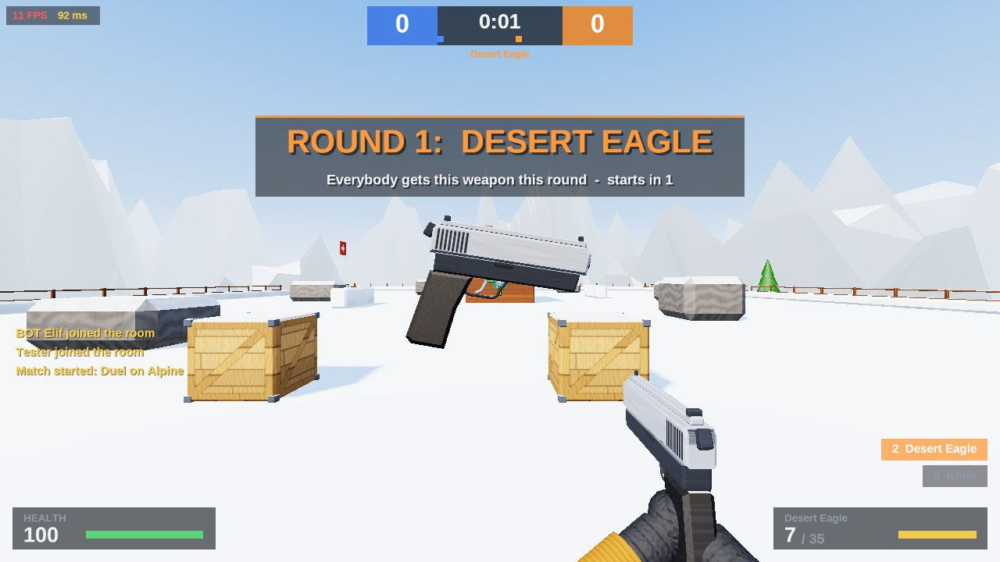
- **Competitive:** rounds with money, like CS and Valorant. Everybody starts with $800 and the free USP-S.
  Kills pay depending on the weapon (knife $1500, Nova $900, MP9 $600, AWP $100, everything else $300), the winners
  of a round get $3250, the losers only $1400 (+$500 for every further round lost in a row, up to $3400). A team kill
  costs $300, the maximum is $16000. Press B during the buy time (the freeze time and 15 seconds after it) to buy:

  | Item | Price | | Item | Price |
  |---|---|---|---|---|
  | USP-S | $200 | | AK-47 | $2700 |
  | Desert Eagle | $700 | | M4A4 | $3100 |
  | Nova | $1050 | | AWP | $4750 |
  | MP9 | $1250 | | HE grenade / flashbang | $300 / $200 |
  | | | | Smoke / molotov | $300 / $400 |
  | Kevlar vest | $650 | | Vest + helmet | $1000 |

  You keep what you bought (and what's left of your armor) as long as you survive; whoever dies starts the next
  round with the USP-S only. Armor you kept costs only what's missing: a vest with 95 points left is topped up for
  $40, the helmet on top of a full vest costs $350. Buying something else for the same slot in the same buy time gives the money back. The
  warmup has $16000 to try everything.

**Armor** (every mode), like in CS: the **Kevlar vest** (100 armor points) makes hits on the chest and stomach weaker,
the **helmet** protects the head as well; legs are never protected. How much gets through depends on the weapon
(AK-47 78 %, M4A4 70 %, USP-S 50 %...), and the armor loses half of what it blocks. With a helmet, a headshot from
the MP9 or a pistol no longer kills (the USP-S does 70 instead of 140); the AK-47, the M4A4 (its headshots go through
the helmet) and the Desert Eagle still one-tap, and the AWP goes straight through any armor. In Competitive you buy it
(above); in all other modes it is free and you choose vest, vest + helmet (the default) or nothing in the loadout (B).
The HUD shows what's left next to your health.

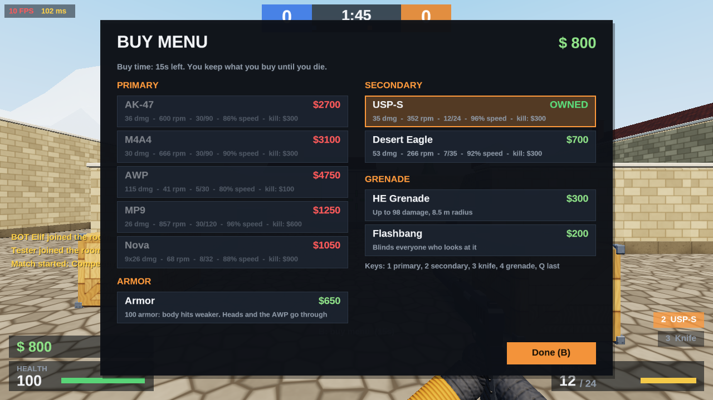

- **Bomb defusal:** Competitive with a bomb, like CS. Team Orange attacks: one of them gets the bomb at the start
  of the round and plants it on **site A or B** (red circles on the floor, letters on the screen) by holding **E**
  for 3.2 s. Team Blue defends: once the bomb is planted they have 40 s to find it and defuse it (hold E for 7 s
  next to it). Moving while planting or defusing starts it over. Orange wins the round by eliminating Blue or when
  the bomb explodes (lethal close by), Blue by defusing it, by eliminating Orange before the plant or when the time
  runs out before it. A dead carrier drops the bomb and any attacker can pick it up. The plant and the defuse pay
  $300, and the attackers get $800 more when the bomb was planted but they lost the round. At halftime (after
  rounds-to-win minus one rounds) the teams switch sides and everybody starts again with $800. Bots carry the bomb to
  a site, plant it, guard it and defuse it.
- **Gun game:** everyone against everyone with instant respawn, and everybody climbs the same ladder of weapons:
  AK-47, M4A4, MP9, Nova, AWP, Desert Eagle, USP-S, knife. Two kills give the next weapon right away (the knife
  needs one). Whoever is killed with a knife goes down one level. The first knife kill on the last level wins the
  match; when the time runs out, the highest level wins. No grenades, no loadout, the weapon modifiers don't apply.
  The HUD shows the level, the kills on it and the next weapon, the scoreboard everybody's level.

Teams are balanced automatically; switch with M, the Esc menu or `/team`.

**Match end scene:** when the match is over (all modes), a short cinematic plays where the last kill happened.
The winner shoots the loser, who drops onto all fours (the gun falls to the floor), then walks over and puts a foot
on the loser's back with the gun raised. A random taunt is stamped on the screen ("Too Easy", "Maybe next time",
"GG's", "Get better", "boring", "OWNED!", ...). It plays once per match, not after every round. Press Space to skip
it, or switch it off in the settings (*Match end animation*). It runs on each client only and changes nothing in the
game.

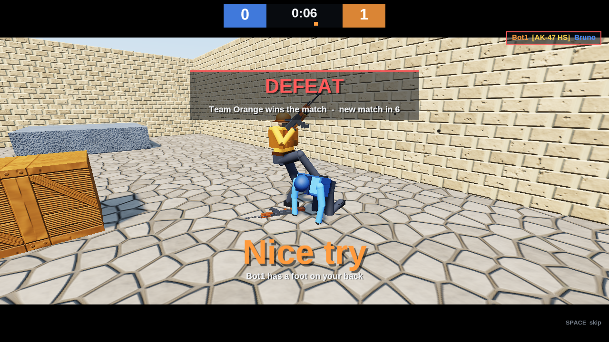

**Killcam:** when another player kills you, the last seconds are replayed through the killer's eyes, with their
weapon in hand, their scope when they aimed through one, and the moment of the kill in slow motion. The bottom bar
shows who got you, with what, whether it was a headshot and how much health the killer has left. It is long in a
round of Elimination (you stay dead) and short where you respawn soon. Press Space to skip it, or switch it off in the
settings (*Killcam*). The client records what it showed anyway, so the killcam costs no bandwidth.

**Dying:** a killed player's knees give way, the upper body sags and the weapon slips out of the hands onto the floor,
then the body tips over away from the shot (with a little twist, never twice the same) and settles on the floor with
the arms flopped out. Each game draws it itself from where the killer stood (the server
only says who died), so it costs no bandwidth and also plays in the killcam.

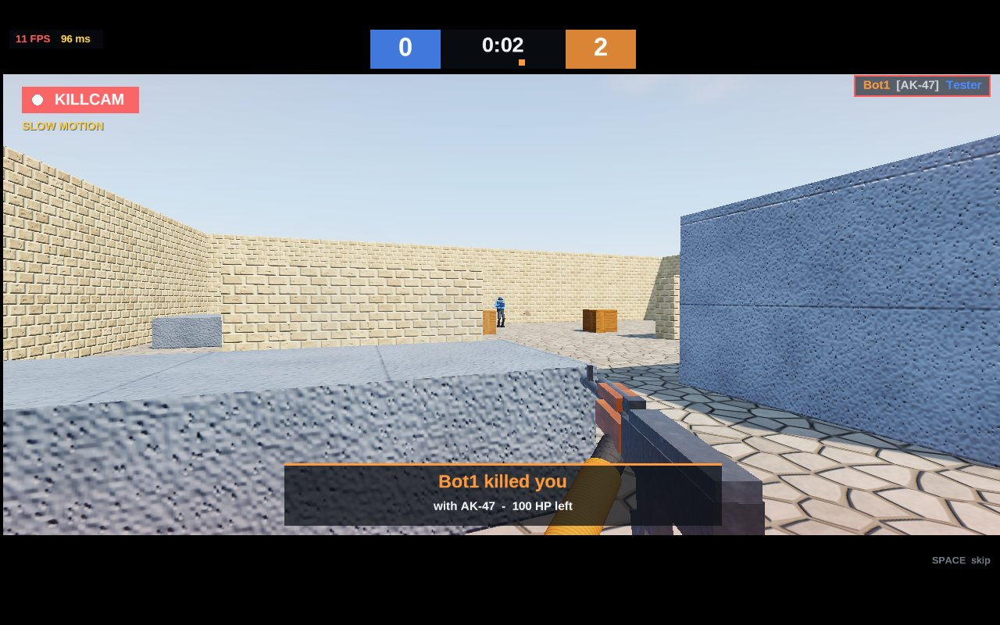

**FPS and ping:** a small readout in the top left corner, each can be switched off in the settings (*Show FPS*,
*Show ping*). The net graph (F8) shows both along with more network details.

## Modifiers

Headshots only · Low gravity · Infinite ammo · No recoil · No spread · One shot kills · Fast movement ·
Auto bunnyhop · Big heads · Vampire (heal half the damage you deal) · Knives only · Pistols only · Snipers only ·
Random weapons (the same random loadout for everybody each round) · Friendly fire · No crosshair · No grenades.

## Skins and coins

- Every account starts with **1000 coins**. You earn **10 per kill** and **50 for winning a match** (warmup
  doesn't count).
- There are two cases. Open the skins screen from the lobby; **Characters** and **Weapons** switch between
  your character skins and weapon skins, the arrows on the case switch between the cases.
- The **Mini Case** costs **100 coins** and contains one of 10 character skins, with the same odds as a CS case:
  Mil-Spec 79.92 % · Restricted 15.98 % · Classified 3.2 % · Covert 0.64 % · Gold 0.26 %.

  | Rarity | Skins |
  |---|---|
  | Mil-Spec (blue) | Woodland, Desert Storm, Arctic, Urban Grid |
  | Restricted (purple) | Toxic, Crimson Web |
  | Classified (pink) | Neon Rider, Ocean Fade |
  | Covert (red) | Dragon Lore |
  | Gold | Golden Legend |

- The **Weapon Case** costs **150 coins** and contains one of 18 weapon skins, same odds:

  | Rarity | Weapon skins |
  |---|---|
  | Mil-Spec (blue) | USP-S Forest Leaves, MP9 Sand Dash, Nova Urban Camo, M4A4 Desert Camo, AWP Safari Net, Desert Eagle Night Ops |
  | Restricted (purple) | AK-47 Red Stripe, M4A4 Cyber Grid, MP9 Toxic Splash, Desert Eagle Cobalt Fade |
  | Classified (pink) | AWP Hex Storm, USP-S Midnight Circuit, AK-47 Tiger Fang |
  | Covert (red) | AWP Dragon Fire, AK-47 Neon Serpent, M4A4 Inferno |
  | Gold | Knife Fade, Knife Crimson Web |

- A skin you already own gives coins back (25 to 1500, depending on rarity).
- Double-click a skin or press **Equip** to wear it; weapon skins are equipped per weapon (one skin for your AK,
  another for your AWP), the weapon filter also lists the default finish to go back to. Everyone in your room
  sees your character skin and the skin of the weapon in your hand; a team-colored band on the chest, arm and
  helmet still shows your team. The console command `equip <skin>` does the same (`equip AK-47 | Red Stripe`).
- The server opens the cases and decides which skin others see, so skins and coins can't be cheated.
- Press **F** in the game to inspect your weapon: it is lifted and turned (the knife is turned over in the hand) and
  the skin's name shows in its rarity color. Firing, aiming, reloading or switching weapons stops it.

| | |
|---|---|
| 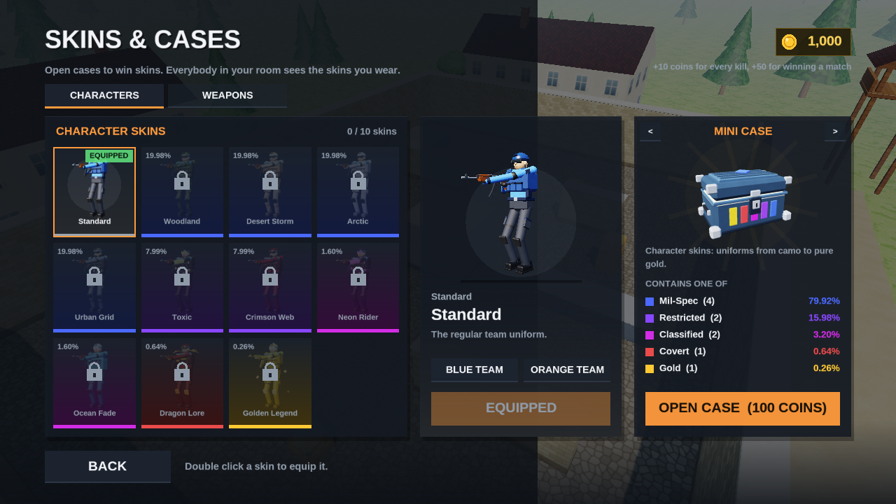 | 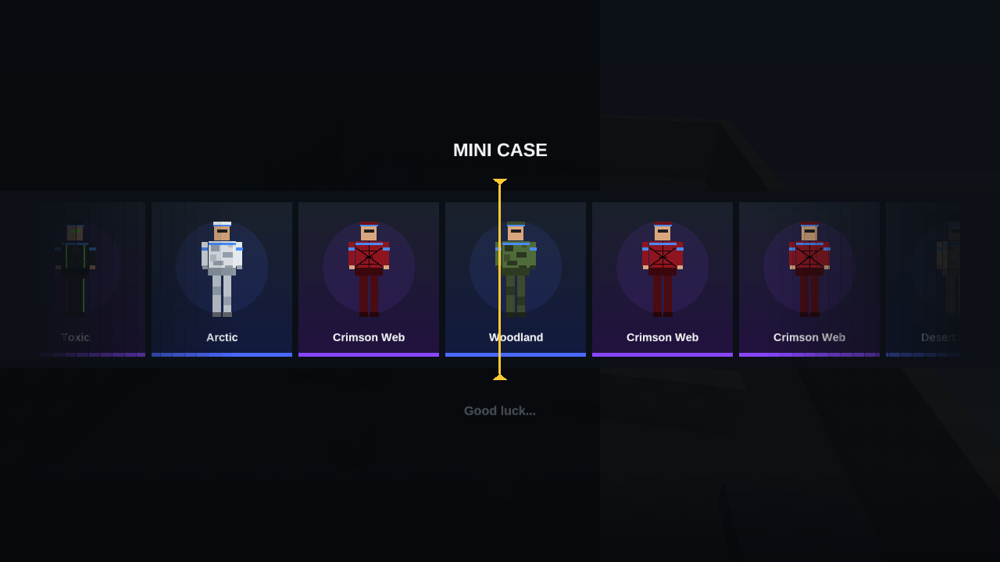 |
| 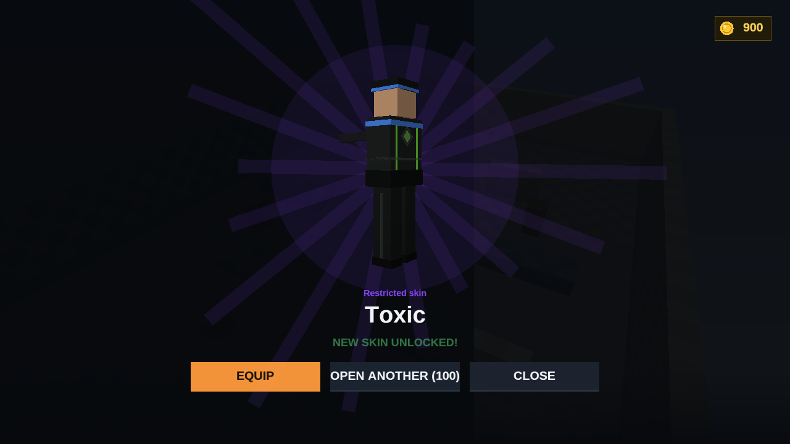 | 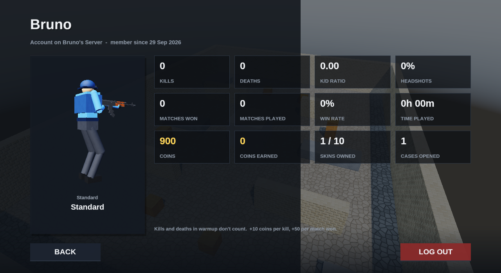 |
| 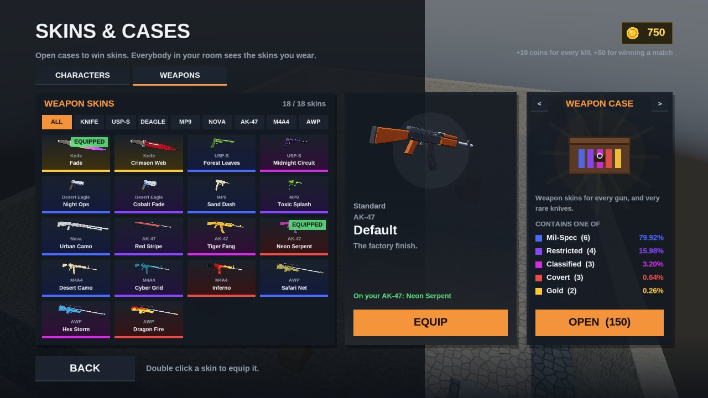 | 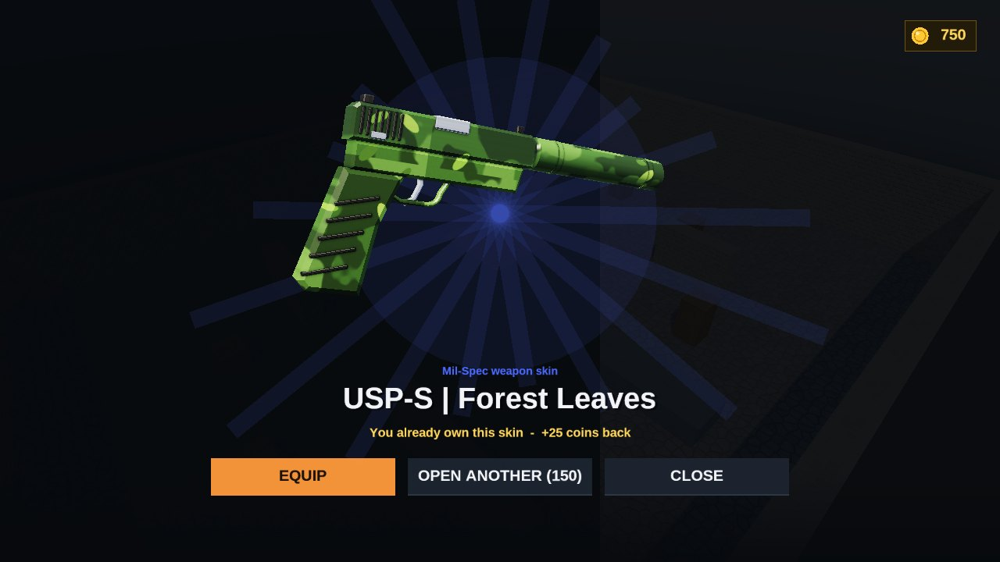 |
| 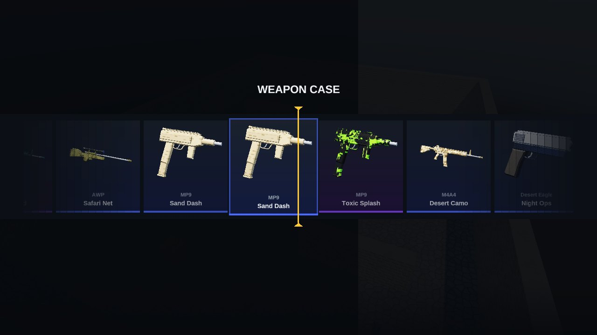 | 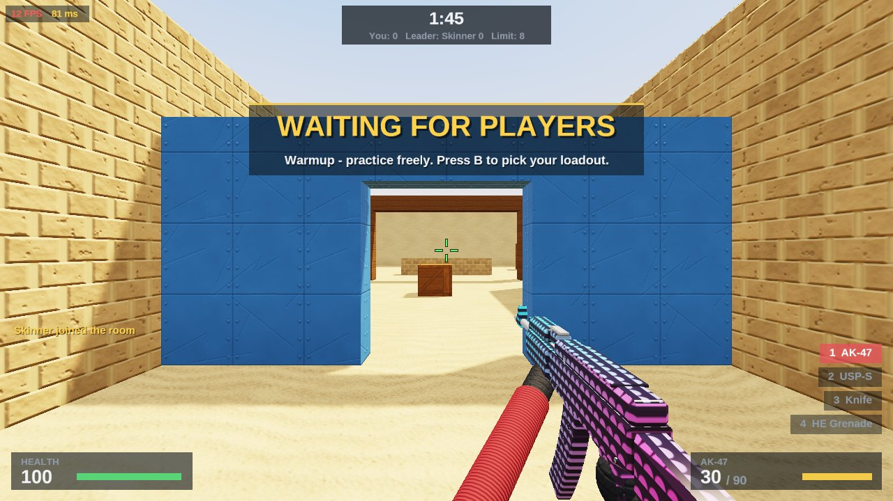 |

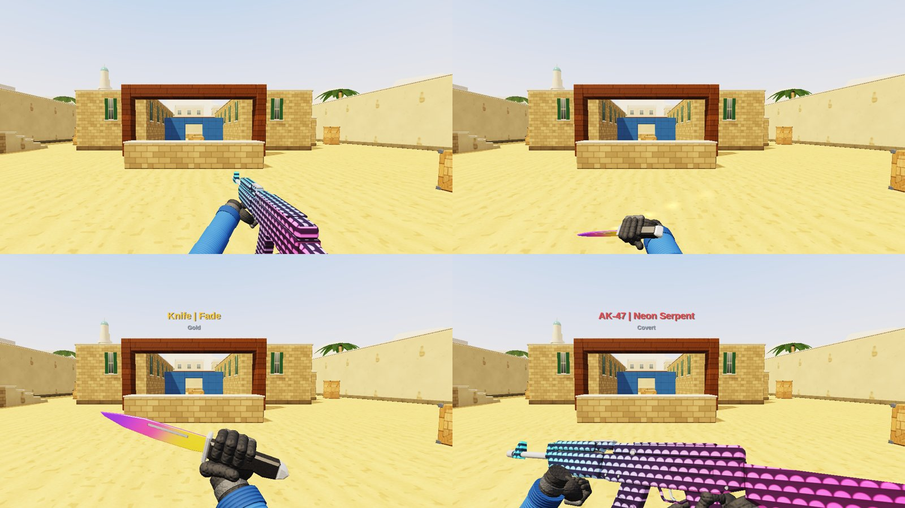

---

# Accounts

**One Mini Strike account works on every server, with one login.** Accounts live on the **account authority**, the
official server; you log in there once when the game starts. Other servers ("community servers") have no passwords
at all: when you join one, the game asks the official server (with your login token) for a **ticket** for that one
server, signed by the official server and valid for 10 minutes. The community server checks the signature and lets
you in - nothing to type.

- **Login tokens:** a password login gives the game a token (random, 256 bits); the game logs in with it from then
  on and fetches its tickets with it. The server keeps only a hash of it, at most 10 per account, and a token not
  used for 60 days ends. "Log out" ends this PC's token, "Log out other PCs" and a password change end all others.
- **The game only logs in at the official server** (its key is built into the game): servers that keep accounts
  of their own, or use another account service, are refused. So your password and your token never go anywhere
  else.
- **No guests online:** dedicated servers let only Mini Strike accounts in (`guests = off` by default); guests are
  for LAN games.
- **Settings with the account:** sensitivity, crosshair, HUD, loadout and volumes are saved on the official server
  (`SETTINGS_REQ`), with the time they changed; the newest wins.

- Each community server keeps what happens there in its own `accounts.db`. By default you also wear your skins
  from the official server there, and your coins there are your official coins plus what you earn and spend
  there (its owner can switch both off: `global_skins`, `global_coins`). Nothing from a community server ever
  reaches your official account: cases opened and coins earned there stay there.
- Logging in on a second PC disconnects the first one.
- After 5 wrong passwords from one address, that address waits a minute.
- **Passwords never leave your PC.** The game turns the password into a key and sends only that key, over the
  encrypted connection, to the official server. Community servers never see it (they get the ticket).
  "Remember me" stores the login token, not the password, in `ministrike_logins.cfg`.
- **Every server gets a different key.** The official server's key is PBKDF2-SHA256 (20 000 rounds, salted with
  the account name, as before protocol 13). Any other server that keeps accounts of its own gets Argon2id over the
  password, the name and that server's own key. So a server like that can't use what it receives to log in to
  your Mini Strike account, and guessing your password from it costs a full Argon2 run per guess. The login
  screen of such a server still warns: don't use your Mini Strike password there.
- **The database holds no logins.** The server stores a salted hash of the key (BLAKE2b), not the key: a stolen
  `accounts.db` or backup can't be used to log in. Databases from before protocol 13 are converted when the server
  starts (it logs how many); older backups still hold the keys, delete them once you don't need them.
- All game traffic is encrypted (see [Log in](#log-in)).

---

# Running a server

One server can host many rooms and keeps everybody's accounts. It needs very little: any 64-bit Linux machine or
small VPS (x86-64, or ARM such as a Raspberry Pi), or a Windows PC.

## Install on Linux

One command installs everything, starts the server in a `tmux` session and sets it up to start at boot:

```
curl -fsSL https://github.com/brunoascic/ministrike-release/releases/latest/download/ministrike.sh | sudo bash
```

It installs what is missing (tmux), stops any Mini Strike server that is already running (also ones started by
hand), downloads the newest release (for x86-64 or 64-bit ARM, e.g. a Raspberry Pi with a 64-bit system), and installs itself as the
`ministrike` command. At the end it prints `Installed: v1.0.x` and the commands below. Next:
[configure](#configure) the server and [open the port](#open-the-port).

| Command | What it does |
|---|---|
| `sudo ministrike update` | install the newest release (backs up the accounts first, keeps your settings) |
| `sudo ministrike console` | open the server console. **Leave it with Ctrl+B, then D** (the server keeps running) |
| `sudo ministrike cmd "<command>"` | run one console command and see its answer, e.g. `sudo ministrike cmd "setrole Bruno admin"` |
| `sudo ministrike start` / `stop` / `restart` | start / stop (saves everything) / restart the server |
| `ministrike status` | running or not, version, players and rooms |
| `ministrike logs` | follow the server log (Ctrl+C to stop watching) |
| `sudo ministrike backup` | copy the accounts and `server.cfg` to `/opt/ministrike/backups/` (the last 20 of each are kept) |
| `sudo ministrike restore [<backup>]` | list the backups, or put one back (`accounts-*.db` or `server-*.cfg`; stops and restarts the server) |
| `sudo ministrike uninstall` | remove the server (keeps your data; `--purge` removes that too) |

Where things are: the programs in `/usr/local/bin`, everything else in `/opt/ministrike` (`server.cfg`,
`accounts.db`, `backups/`, `logs/`). The server runs as the user `ministrike` in the tmux session `ministrike`;
systemd starts it at boot, and it restarts by itself after a crash. Typing `quit` in the console stops it until
the next `sudo ministrike start` (or reboot).

## Configure

Edit the settings with `sudo nano /opt/ministrike/server.cfg`, then `sudo ministrike restart`.

| Setting | Default | Meaning |
|---|---|---|
| `name` | Mini Strike Server | name shown in the server list and the lobby |
| `motd` | Welcome! ... | message shown in the lobby |
| `port` | 27015 | UDP port |
| `max_clients` | 64 | players connected at the same time |
| `max_rooms` | 32 | rooms at the same time (1-32) |
| `accounts` | central | `central` = Mini Strike accounts (players log in through the official server); `off` = no logins, everybody is a guest; `authority` = only for the official server |
| `global_skins` | on | community servers: players can also wear the skins of their Mini Strike account (`off` = only skins won here) |
| `global_coins` | on | community servers: the balance here is the player's official coins plus what they earn / spend here (`off` = everybody starts with 1000 here) |
| `authority_key` | – | the account authority's public key (64 hex digits); default: the official server's key built into the server |
| `public` | on | listed in the game's server browser (the official server checks that it can reach your port first; `off` = only players who know the address find it) |
| `authority_address` | – | where the account authority is (`host[:port]`); default: the official server. Only needed together with your own `authority_key` |
| `guests` | off | `on` = also let in guests without an account (online everybody has one; guests are for LAN games) |
| `accounts_file` | accounts.db | the account database (relative to `/opt/ministrike`) |
| `key_file` | server.key | the server's key (see below); created on the first start |
| `admin`, `moderator` | – | staff of this server, e.g. `admin = YourName` (one line per person) |
| `roles_file` | – | a staff file several servers can share (see [admins and moderators](#admins-and-moderators)) |
| `room` | three examples | permanent rooms, e.g. `room = 1v1 Arena \| map=arena \| mode=elimination \| players=2` |
| `ban` | – | an IP address that can't connect (one line per address) |

`server.cfg.example` explains every setting, including all the options of `room` lines (map, mode, players,
score, time, health, freeze, password, weather, modifiers).

## Open the port

Players reach the server on **UDP port 27015** (not TCP).

- **Router:** forward UDP 27015 to the server's local IP address. Give the server a fixed local IP (a DHCP
  reservation in the router) so the forward doesn't break.
- **Firewall on the server:** the installer opens the port in `ufw` if that is active; other firewalls need
  UDP 27015 opened by hand.
- **Domain name (optional):** point a DNS record at your public IP (an A record, or a CNAME to a dynamic DNS
  name if your IP changes). Players then type the name instead of the IP; the official server works this way
  (`game.ministrike.ch`). If you use Cloudflare, set the record to **DNS only** (grey cloud): the proxy does
  not carry game traffic.
- **Behind CGNAT** (no public IPv4, so port forwarding can't work): put the server and the players in a VPN such
  as Tailscale or ZeroTier and use the server's VPN address.
- **Check:** in the game, click **Change** on the login screen and type your address. The server should appear
  with its name and ping. Testing from inside your own network with your public address often fails even when
  everything is set up right, so ask someone outside to try.
- **Server browser:** with `public = on` the server log says `listed in the server browser as <ip>:<port>` once
  the official server reached it, or a warning that it couldn't (then the port forward is missing).

## Update to a new version

Every merged pull request publishes a new release. To update:

```
sudo ministrike update
```

That's it. It stops the server (which saves everything), backs up `accounts.db` and `server.cfg` to
`/opt/ministrike/backups/` (the last 20 are kept), installs the new version, starts it again in tmux and prints
`Updated: <old version> -> <new version>`. Your `server.cfg`, accounts and logs stay.

- **Players:** a new release often changes the network protocol. Old games then can't connect and show "Server
  runs a different game version", so tell your players to get the game zip from the same release.
- **A specific version / going back:** `sudo ministrike update --version v1.0.3`. To restore the accounts too:
  `sudo ministrike restore` lists the backups, `sudo ministrike restore accounts-<date>.db` puts one back.
- **Installed with the older `install_server.sh`?** Just run the one-line install above once; it takes over the old
  installation (same folders, accounts and settings) and moves the server into tmux.

## Manage the server

**Server console:** `sudo ministrike console` opens the console of the running server, where you can type any
[admin command](#admins-and-moderators) with full rights (for example `setrole Bruno admin`, `players`,
`announce Restart in 5 minutes`). Scroll with the mouse wheel. **Leave with Ctrl+B, then D**: press Ctrl and B
together, let go, then press D. Don't type `quit` unless you want to stop the server.

For a single command without opening the console: `sudo ministrike cmd "players"`.

**Admin dashboard (official server):** the team's dashboard (admin.ministrike.ch, its own repository) talks to a
small agent on the VM, `ministrike-agent` (`scripts/ministrike-agent.py`). It connects out to the dashboard's relay
with the VM's managed identity, so no port is opened, and only runs console commands, status, logs, restart, backup
and update. Every request is written to `/opt/ministrike/logs/dashboard.log`. The dashboard's deploy script names the
relay in `/opt/ministrike/azure.cfg` and starts the agent with `sudo ministrike dashboard`.

Admins can also use the same commands in the game: log in and press F1.

**The server's key** (`/opt/ministrike/server.key`) is created on the first start. All traffic is encrypted, and
players' games recognise your server by this key: they remember it on the first visit and refuse to connect if it
ever changes (that protects them from someone posing as your server). So keep it: `ministrike backup` and
`update` back it up with the accounts, and `ministrike restore server-<date>.key` puts it back. If you lose it,
the server makes a new one, and every player has to delete your server's line in `ministrike_known_servers.txt`
once. The server log shows the key at every start (`server key ... (3f2a 9c1e 5b7d 4e8a, public key ...)`).
A server that keeps accounts of its own (not the usual Mini Strike accounts) needs the key for them too: the
passwords' keys depend on it, so with a new key its players have to make new accounts.

## Admins and moderators

Every server has its own staff. This works on any server, official or not: whoever runs a server decides who
its admins and moderators are.

**Global staff and global bans.** The Mini Strike team (admins and the owner of the official server) are admins on
every server that uses Mini Strike accounts, and a ban on the official server counts everywhere: every few
seconds a server asks the official server about the accounts and addresses online, and disconnects the ones it
has banned (they see "You are banned from all Mini Strike servers"). Everything else is up to you: your own
staff and bans only count on your server.

**Make someone admin or moderator** (they need an account on that server):

- in `server.cfg`: `admin = YourName` or `moderator = FriendsName` (one line per person), then restart;
- or in the server console / as an admin in the game console: `setrole <name> moderator` (the server console can
  also give `admin`; saved in `accounts.db`);
- **several servers:** put the staff into one file and point every server to it with `roles_file = <path>` in
  their `server.cfg`. One line per person: `admin YourName` or `moderator FriendsName`. The servers read the file
  again when it changes, no restart needed.

Staff get a badge next to their name and see more commands in `help`. Guests never get a role (their names are
not protected by a password).

| Command | Role | What it does |
|---|---|---|
| `players`, `rooms`, `top`, `help` | everyone | who is online (admins also see IP addresses), rooms, best players |
| `kick <name> [reason]` | moderator | disconnect a player |
| `mute <name> [minutes] [reason]`, `unmute <name>` | moderator | block someone's chat (default 10 minutes) |
| `ban <name> [time] [reason]` | moderator | ban an account (guests: their IP address). `time`: `30m`, `12h`, `7d`, `perm`. Moderators: at most 1 day |
| `unban <name\|ip>`, `bans` | moderator | lift a ban, list active bans |
| `announce <text>` | moderator | message to every room |
| `closeroom <id>`, `account <name>`, `staff`, `status` | moderator | close a room, show an account, list the staff, server overview |
| `ipban <ip\|name> [time] [reason]` | admin | ban an IP address (any length) |
| `givecoins <name> <n>`, `setcoins <name> <n>` | admin | add / take (`-50`) / set coins |
| `giveskin <name> <skin\|all>`, `takeskin <name> <skin\|all>` | admin | skins by name (`dragon lore`) or number |
| `setrole <name> <user\|moderator>` | admin | make or remove moderators |
| `accounts` | admin | number of accounts |
| `setrole <name> admin\|owner`, `delaccount <name>`, `reload`, `quit` | owner | make admins and owners, delete an account, reload the roles file, stop. The server console is always owner; `setrole <name> owner` gives someone the same rights in the game |

Staff can't kick, mute or ban someone with the same or a higher role. Every staff command is written to the
server log (`ministrike logs`). Banned players see the reason and how long the ban lasts when they
try to log in.

## Other ways to run it

**Windows:** start `ministrike_server.exe` from the game zip (put a `server.cfg` next to it to configure it) and
allow it through the Windows firewall. To update, stop it, replace the exe with the new one, start it again;
`accounts.db` next to it stays.

**By hand (any OS):** `ministrike_server [options]`

| Option | Meaning |
|---|---|
| `--config <file>` | settings file (default: `server.cfg` in the current folder, if it exists) |
| `--port <port>` | UDP port (default 27015) |
| `--name <name>` | server name |
| `--max-rooms <n>`, `--max-clients <n>` | limits |
| `--accounts <file>` | account database (default `accounts.db`) |
| `--no-guests` | players must log in (the default; `guests = on` in `server.cfg` lets guests in) |
| `--test-authority` | testing: `accounts = authority` with this server's own key (start the game with `--account-service <address>`) |
| `--version`, `--help` | print the version / the options |

**Bots for practice:** `ministrike_bot --server <address> --room "My room" --count 3` (add `--skin all` for
different skins).

---

# Limitations

- No anti-cheat beyond the server being in charge and the input rate limit.
- Coins, skins and stats are kept per server.
- Collision uses boxes only (stairs but no ramps); bullets don't go through walls.
- The game needs Windows with Direct3D 11; the server and bot run on Windows and Linux.
- The Windows programs are not code-signed, so antivirus software may warn about them (see
  [Get the game](#get-the-game)).

---

# Credits

The guns, reloads, explosions, knife, footsteps, voices and weather are **real recordings** from
[freesound.org](https://freesound.org) and [soundbible.com](https://soundbible.com), released under CC0 or
Creative Commons Attribution (CC BY 3.0 / 4.0) by their authors - for example DoctorBoomstick's recordings of a 5.56
rifle on a gun range and of real magazine changes. They were collected with their attribution in the
[CC-Sounds](https://github.com/Fris0uman/CDDA-Soundpacks) pack. The menu and case opening sounds are from
[Red Eclipse](https://www.redeclipse.net) (CC BY-SA 4.0). `sound-credits/CREDITS.md` in the game zip lists the author, license
and link of every file; the licenses cover the sound files, not the rest of the game. Only the ringing ears after a
flashbang, the smoke, molotov, fire and bomb sounds and the gun game level up are synthesized.

The licenses of the code and assets from other people that come with the game are in [THIRD-PARTY-NOTICES.md](THIRD-PARTY-NOTICES.md); the game itself: [LICENSE.txt](LICENSE.txt).
